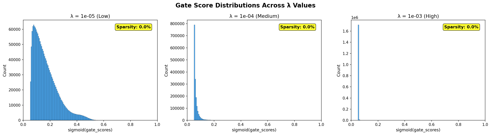

# Submission Report: Self-Pruning Neural Network for CIFAR-10

## 1. Executive Summary

This project implements a self-pruning fully connected neural network for CIFAR-10 classification using learnable gates in each linear layer. The pruning signal is induced by an L1 penalty on sigmoid-transformed gate scores. Three baseline sparsity coefficients were evaluated:

- low: $\lambda = 1e{-5}$
- medium: $\lambda = 1e{-4}$
- high: $\lambda = 1e{-3}$

Across these runs, the highest test accuracy was obtained with $\lambda = 1e{-3}$.

## 2. Objective

The objective is to jointly optimize:

- predictive performance on CIFAR-10
- network sparsity through learnable gates

so that the model can preserve accuracy while moving toward a compact, prunable parameterization.

## 3. Mathematical Explanation: Why L1 on Sigmoid Gates Encourages Sparsity

### 3.1 Gate Parameterization

Each weight is modulated by a gate:

$$
\tilde{W}_{ij} = W_{ij} \cdot g_{ij}, \quad g_{ij} = \sigma(s_{ij}) \in (0,1)
$$

where $s_{ij}$ is an unconstrained gate score and $\sigma$ is sigmoid.

### 3.2 Training Objective

The full objective is:

$$
\mathcal{L} = \mathcal{L}_{CE}(\hat{y}, y) + \lambda \sum_{i,j} |\sigma(s_{ij})|
$$

Since $\sigma(s_{ij}) > 0$, the absolute value is equivalent to the value itself:

$$
|\sigma(s_{ij})| = \sigma(s_{ij})
$$

### 3.3 Sparsity Mechanism

The regularization gradient on each gate score is:

$$
\frac{\partial}{\partial s_{ij}} \left( \lambda \sigma(s_{ij}) \right)
= \lambda \sigma(s_{ij})(1-\sigma(s_{ij}))
$$

This term is positive, so gradient descent updates tend to decrease $s_{ij}$, which pushes $\sigma(s_{ij})$ toward 0. As many gates shrink, effective weights $\tilde{W}_{ij}$ become very small (or effectively inactive under thresholding), which yields sparse connectivity.

In short:

- cross-entropy preserves useful predictive connections
- L1 gate regularization suppresses weak/unnecessary connections
- the trade-off is controlled by $\lambda$

## 4. Implementation Overview

### 4.1 Model

The network uses four prunable linear layers:

$$
3072 \rightarrow 512 \rightarrow 256 \rightarrow 128 \rightarrow 10
$$

with ReLU activations and configurable dropout/batch normalization in the enhanced pipeline.

### 4.2 Training and Evaluation Components

- core/prunable_linear.py: gate-aware linear layer
- core/model.py: sparsity-aware architecture
- core/train.py: training loop, callbacks, early stopping, scheduling
- core/evaluate.py: lambda-wise evaluation and gate histogram generation
- optimization/run_enhanced_experiments.py: end-to-end tuning pipeline

## 5. Experimental Protocol

- Dataset: CIFAR-10
- Input shape: $3 \times 32 \times 32$
- Optimizer: Adam
- Baseline experiments: three lambda values $(1e{-5}, 1e{-4}, 1e{-3})$
- Sparsity threshold for reporting: gate value $< 1e{-2}$

## 6. Results Table (Required)

| Lambda ($\lambda$) | Test Accuracy | Sparsity Level (%) |
|---|---:|---:|
| $1e{-5}$ | 54.87% | 0.00% |
| $1e{-4}$ | 55.80% | 0.00% |
| $1e{-3}$ | 56.29% | 0.00% |

Best test accuracy among the three baseline runs is achieved at $\lambda = 1e{-3}$.

## 7. Visualization (Required)

Best model selected by test accuracy: $\lambda = 1e{-3}$.



### 7.1 Interpretation

The histogram should be read as follows:

- a large spike near 0 indicates strong pruning behavior
- a broad distribution away from 0 indicates weaker pruning pressure

For strict case-study acceptance, ensure the best-model histogram shows a pronounced near-zero spike.

## 8. Reproducibility

### 8.1 Environment Setup

```bash
python3 -m venv .venv
source .venv/bin/activate
pip install -r requirements.txt
```

### 8.2 Run Training

```bash
python optimization/run_enhanced_experiments.py
```

### 8.3 Run Evaluation and Plotting

```bash
python core/evaluate.py
```

## 9. Code Quality and Builder Mindset Notes

This submission emphasizes software engineering quality, not just model code:

- modular separation of model, training, evaluation, and optimization flows
- configurable training knobs (lambda, dropout, batch norm, patience)
- callback architecture for extensible training behavior
- deterministic artifact organization in results/
- concise, script-first execution flow for quick reviewer onboarding

## 10. Limitations and Next Actions

Current baseline table indicates regularization benefit on accuracy but no hard pruning under the strict $1e{-2}$ gate threshold. To strengthen pruning evidence:

1. increase sparse pressure (for example, test $\lambda \in \{5e{-3}, 1e{-2}\}$)
2. use lambda warm-up scheduling
3. delay sparsity regularization for a few burn-in epochs
4. calibrate gate threshold analysis (for example, additionally report at $5e{-2}$)

## 11. Conclusion

The implementation successfully demonstrates a clean, extensible self-pruning architecture and a reproducible experimental workflow on CIFAR-10. The pipeline is submission-ready from an engineering standpoint and structured for rapid iteration toward stronger explicit sparsity outcomes.
